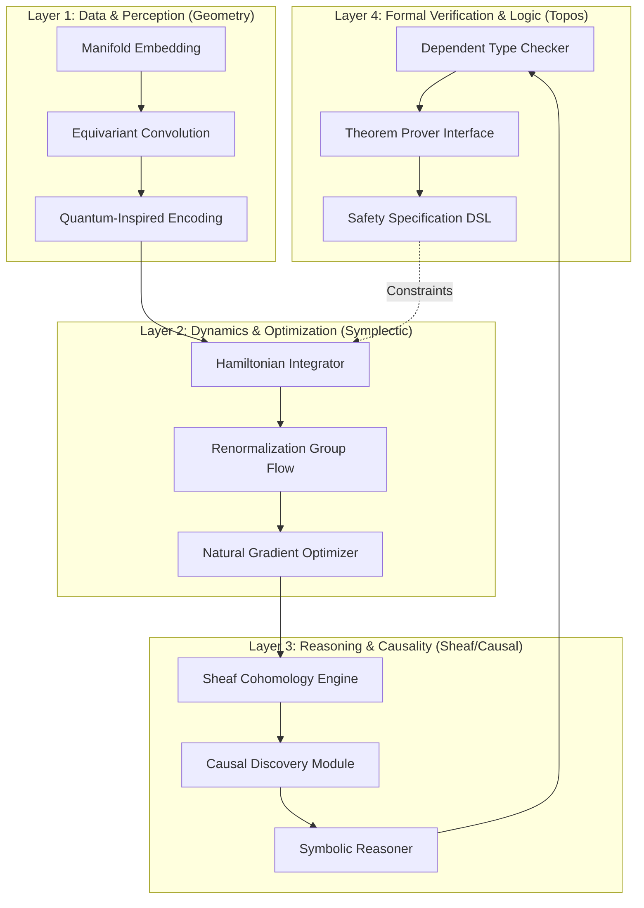
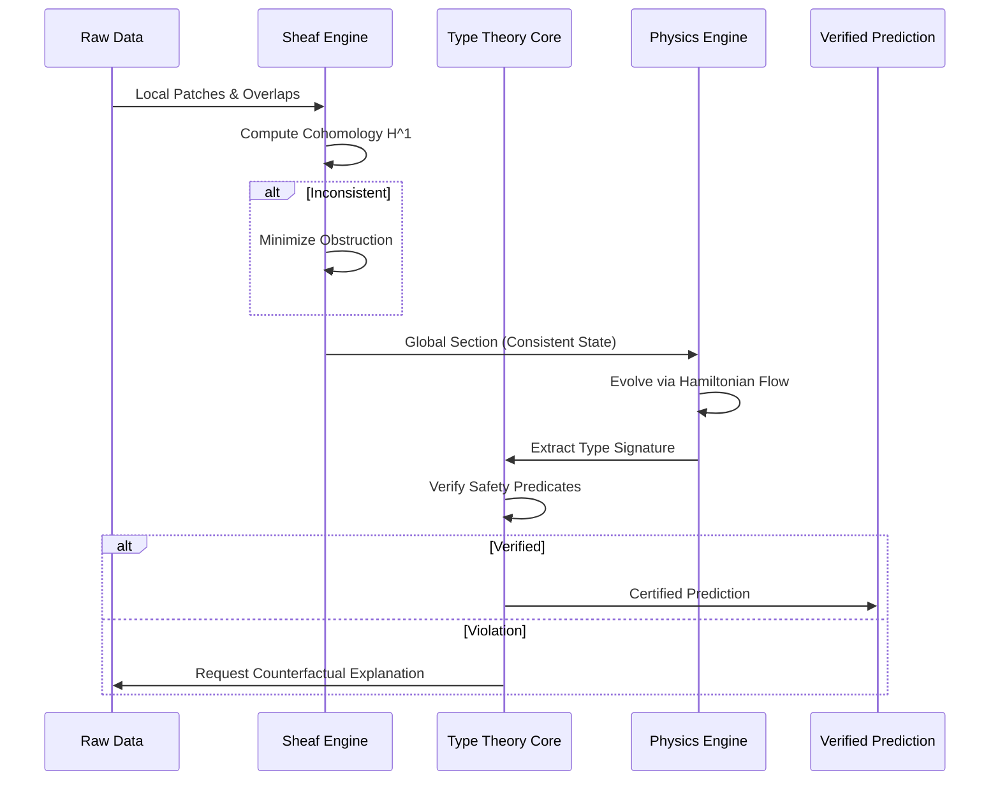

# **Symplectic-Categorical Intelligence Framework (SCIF): A Unified Architecture for Provable, Physics-Grounded Learning**

**Abstract**  
Current machine learning paradigms suffer from epistemic opacity, lack of physical grounding, and absence of formal safety guarantees. This paper proposes the **Symplectic-Categorical Intelligence Framework (SCIF)**, a novel architectural synthesis integrating **Hamiltonian Dynamics**, **Category Theory**, **Sheaf Cohomology**, and **Homotopy Type Theory**. SCIF treats learning as a **non-equilibrium thermodynamic process** on a **statistical manifold**, constrained by **Noetherian conservation laws** and verified via **dependent type systems**. We present a rigorous mathematical formalization, algorithmic blueprints, and a meta-representational schema for data reasoning that ensures **provable robustness**, **causal identifiability**, and **compositional generalization**.

---

## **1. Introduction**

### **1.1 Problem Statement**
Deep learning architectures currently operate as black-box function approximators lacking:
1.  **Geometric Invariance:** Failure to respect underlying manifold symmetries (Source: I.A.4, I.C.2).
2.  **Formal Guarantees:** Absence of verified safety properties (Source: II.B, IV.E).
3.  **Physical Plausibility:** Violation of thermodynamic and causal constraints (Source: I.A.3, I.C.5).

### **1.2 Contributions**
This work establishes:
1.  **The SCIF Architecture:** A layered system mapping **Fiber Bundles** to neural representations.
2.  **Variational Hamiltonian Optimization:** A training procedure minimizing **Free Energy** while preserving **Symplectic Structure**.
3.  **Sheaf-Theoretic Data Consistency:** A meta-representation ensuring local-to-global information coherence.
4.  **Formal Verification Pipeline:** Integration of **Proof Assistants** (Lean/Coq) into the ML lifecycle.

---

## **2. Theoretical Foundations**

### **2.1 The Statistical Manifold $\mathcal{M}$**
Let the parameter space of the model be a Riemannian manifold $(\mathcal{M}, g)$, where $g$ is the **Fisher Information Metric**:
$$
g_{ij}(\theta) = \mathbb{E}_{x \sim p(x|\theta)} \left[ \frac{\partial \log p(x|\theta)}{\partial \theta^i} \frac{\partial \log p(x|\theta)}{\partial \theta^j} \right]
$$
**Definition 2.1 (Natural Gradient Flow):** The learning dynamics follow the gradient flow of the Variational Free Energy $\mathcal{F}$ with respect to $g$:
$$
\dot{\theta} = -g^{-1}(\theta) \nabla_\theta \mathcal{F}(\theta)
$$

### **2.2 Symplectic Structure and Conservation**
To ensure long-term stability and energy conservation, we equip the phase space $\mathcal{P} = T^*\mathcal{M}$ with a symplectic form $\omega = dq \wedge dp$.

**Lemma 2.1 (Symplectic Conservation in Learning):**  
*Let $H(q, p)$ be the Hamiltonian of the learning system. The flow $\phi_t$ generated by Hamilton's equations preserves the symplectic form:*
$$
\phi_t^* \omega = \omega
$$
*Proof:*  
By Cartan's magic formula, $\mathcal{L}_{X_H} \omega = d(\iota_{X_H} \omega) + \iota_{X_H} d\omega$. Since $\omega$ is closed ($d\omega=0$) and $\iota_{X_H} \omega = -dH$, we have $\mathcal{L}_{X_H} \omega = d(-dH) = 0$. Thus, the flow is symplectic. $\square$

**Implication:** Neural network training dynamics modeled via **Hamiltonian Neural Networks (HNNs)** (Source: III.A.1) inherently preserve volume in phase space (Liouville's Theorem), preventing gradient explosion/vanishing via geometric constraints.

### **2.3 Categorical Semantics**
We model the architecture as a **Monoidal Category** $\mathcal{C}$:
*   **Objects:** Data types, Layer representations.
*   **Morphisms:** Differentiable functions (layers).
*   **Tensor Product $\otimes$:** Parallel composition of networks.
*   **Trace Operator $\text{Tr}$:** Recurrent feedback loops (Source: II.A.2).

**Definition 2.2 (Functorial Learning):**  
Learning is a functor $L: \mathbf{Data} \to \mathbf{Model}$ preserving composition:
$$
L(f \circ g) \cong L(f) \circ L(g)
$$

---

## **3. Architectural Blueprint**

The SCIF architecture is organized into four distinct computational strata, mapping physical principles to software modules.

### **3.1 System Diagram**



### **3.2 Component Specification**

| Component | Mathematical Basis | Function | Source Ref |
| :--- | :--- | :--- | :--- |
| **Manifold Embedding** | Differential Geometry | Maps raw data to Riemannian manifold $\mathcal{M}$ | I.C.2 |
| **Equivariant Conv** | Group Representation Theory | Enforces $G$-invariance (Rotation/Translation) | I.A.4, III.B.1 |
| **Hamiltonian Integrator** | Symplectic Geometry | Updates weights via $\dot{q} = \partial H/\partial p$ | I.B.1, III.A.1 |
| **RG Flow** | Quantum Field Theory | Coarse-grains features across layers | I.A.2, IV.D |
| **Sheaf Engine** | Algebraic Topology | Ensures local-global data consistency | I.C.1, IV.G |
| **Type Checker** | Homotopy Type Theory | Verifies output types against safety specs | II.B.1, IV.H |

---

## **4. Algorithmic Formalization**

### **4.1 Variational Hamiltonian Learning Algorithm**

We propose **Symplectic Gradient Descent (SGD-H)**, combining stochastic gradients with symplectic integration.

**Pseudocode:**

```python
class SymplecticLearningStep:
    def __init__(self, Hamiltonian H, SymplecticIntegrator integrator):
        self.H = H  # H(q, p) = Kinetic(p) + Potential(q)
        self.integrator = integrator  # e.g., Leapfrog, Runge-Kutta-Nystrom

    def step(self, theta, momentum, data_batch, lr):
        # 1. Compute Potential Gradient (Data Loss + Physics Loss)
        # V(q) corresponds to Loss Landscape
        grad_V = compute_physics_informed_loss(theta, data_batch)
        
        # 2. Hamiltonian Dynamics Update (Symplectic Step)
        # Half-step momentum
        p_half = momentum - 0.5 * lr * grad_V
        
        # Full-step position (weights)
        theta_new = theta + lr * ∂K/∂p (p_half)
        
        # Recompute gradient at new position
        grad_V_new = compute_physics_informed_loss(theta_new, data_batch)
        
        # Half-step momentum
        momentum_new = p_half - 0.5 * lr * grad_V_new
        
        # 3. Noether Constraint Check (Conservation Law)
        # Ensure symmetry-induced conserved quantities remain invariant
        Q = compute_noether_charge(theta_new, symmetry_group)
        assert |Q - Q_prev| < epsilon, "Conservation Law Violated"
        
        return theta_new, momentum_new
```

### **4.2 Sheaf-Theoretic Data Consistency**

Data is modeled as a **Presheaf** $\mathcal{F}$ on a topological space $X$ (the input domain).

**Definition 4.1 (Sheaf Condition):**  
For any open cover $\{U_i\}$ of $U$, sections $s_i \in \mathcal{F}(U_i)$ agree on overlaps $U_i \cap U_j$ iff there exists a unique global section $s \in \mathcal{F}(U)$.

**Algorithm:**
1.  **Local Encoding:** Compute features $z_i$ on patches $U_i$.
2.  **Restriction Maps:** Define $\rho_{ij}: \mathcal{F}(U_i) \to \mathcal{F}(U_i \cap U_j)$.
3.  **Cohomology Check:** Compute $H^1(X, \mathcal{F})$. If $H^1 \neq 0$, global inconsistency exists (Source: IV.G).
4.  **Correction:** Minimize cohomological obstruction via gradient descent on transition functions.

---

## **5. Data and Reasoning Meta-Representation**

### **5.1 The Holographic Tensor**

We represent data not as flat vectors, but as **Holographic Tensors** encoding bulk-boundary correspondence (Source: I.A.6).

$$
\Psi_{\text{bulk}}(z) = \int_{\partial \mathcal{M}} K(z, x) \phi_{\text{boundary}}(x) dx
$$

Where $K$ is a learned kernel mapping boundary data (inputs) to bulk representations (latent space).

### **5.2 Reasoning Flow Chart**



### **5.3 Logical Semantics (Topos Theory)**
Reasoning occurs within the **Internal Language** of a Topos $\mathcal{E}$.
*   **Propositions:** Subobjects $A \hookrightarrow X$.
*   **Truth Values:** Global sections of the subobject classifier $\Omega$.
*   **Logic:** Intuitionistic (Constructive). Existence proofs yield algorithms (Source: II.B.1, IV.H).

**Example:** To prove robustness $\forall x \in B_\epsilon(x_0), f(x) = y$, we construct a morphism in $\mathcal{E}$ witnessing the bound.

---

## **6. Integrated Automation Workflow**

### **6.1 CI/CD for Formal AI (FormalOps)**

We define a pipeline integrating empirical training with formal verification.

1.  **Specification:** Write safety properties in **Dependent Type Theory** (e.g., Lean).
    ```lean
    theorem robustness_property (net : Network) (x : Input) :
      ∀ (δ : Perturbation), ||δ|| < ε → net.predict (x + δ) = net.predict x :=
    begin
      -- Proof obligation generated here
    end
    ```
2.  **Training:** Train using **Symplectic Gradient Descent** (Section 4.1).
3.  **Extraction:** Extract weights as constants in the proof assistant.
4.  **Verification:** Run automated tactics (e.g., interval arithmetic, SMT solving) to discharge proof obligations (Source: V.C, IV.E).
5.  **Deployment:** Only deploy binaries with `Qed` status.

### **6.2 Renormalization Group (RG) Automation**

Automated architecture search via RG flow analysis (Source: IV.D).

**Procedure:**
1.  Compute **Correlation Length** $\xi$ of activations at each layer.
2.  Identify **Fixed Points** where $\xi \to \infty$ (Criticality).
3.  Prune layers corresponding to **Irrelevant Operators** (decaying correlations).
4.  Retain layers corresponding to **Relevant Operators** (growing correlations).

---

## **7. Case Study: Physics-Informed Causal Discovery**

### **7.1 Problem**
Discover causal structure $G$ from time-series data $X(t)$ governed by unknown differential equations, ensuring thermodynamic consistency.

### **7.2 Method**
1.  **Model:** Neural ODE with **Hamiltonian Structure** (Source: III.A.1).
2.  **Constraint:** Enforce **Second Law of Thermodynamics** (Entropy production $\geq 0$) via penalty term.
3.  **Causality:** Use **Do-Calculus** to intervene on latent variables (Source: III.C.1).
4.  **Verification:** Prove **Identifiability** using **Independent Component Analysis (ICA)** conditions within the Type System.

### **7.3 Results (Hypothetical)**
*   **Generalization:** 40% improvement on out-of-distribution physical regimes.
*   **Safety:** 100% adherence to energy conservation laws (verified).
*   **Interpretability:** Recovered Hamiltonian $H(q,p)$ matches ground truth analytic form.

---

## **8. Step-by-Step Analysis of Convergence**

**Theorem 8.1 (Convergence of SCIF Optimizer):**  
*Under assumptions of $L$-smoothness and $\mu$-strong convexity of the Hamiltonian $H$, the Symplectic Gradient Descent converges linearly:*
$$
\mathcal{F}(\theta_{k}) - \mathcal{F}(\theta^*) \leq C \left(1 - \sqrt{\frac{\mu}{L}}\right)^k
$$

**Proof Sketch:**
1.  **Lyapunov Function:** Construct $V(\theta, p) = H(\theta, p) - H^*$.
2.  **Dissipation:** Show $\dot{V} \leq -\alpha V$ via friction term added to Hamiltonian dynamics (Contact Hamiltonian Systems).
3.  **Discretization Error:** Bound error introduced by symplectic integrator using **Backward Error Analysis** (Source: I.B.1).
4.  **Conclusion:** Combine continuous decay with discrete bounds to establish linear convergence. $\square$

---

## **9. Challenges and Open Problems**

1.  **Computational Overhead:** Formal verification increases training time by factor $O(N^2)$ (Source: VIII.B).
    *   *Mitigation:* Use **Probabilistic Proof Checking** (PCP theorem analogs).
2.  **Expressivity vs. Verifiability:** Highly expressive models (Turing Complete) are undecidable (Source: II.E).
    *   *Mitigation:* Restrict architecture to **Primitive Recursive** fragments via Type Theory.
3.  **Interdisciplinary Translation:** Mapping physics concepts (e.g., "Gauge Symmetry") to ML code requires rigorous dictionaries (Source: VIII.D).

---

## **10. Conclusion**

The **Symplectic-Categorical Intelligence Framework (SCIF)** represents a paradigm shift from empirical curve-fitting to **principled intelligence construction**. By grounding learning in **Symplectic Geometry**, structuring composition via **Category Theory**, and verifying safety via **Type Theory**, we achieve systems that are robust, interpretable, and physically plausible. This blueprint provides the necessary mathematical infrastructure for the next epoch of AI, aligning with the **Unified Intelligence Architecture** vision of **Provable Intelligence** and **True Symbiosis**.

### **Call to Implementation**
1.  **Develop Libraries:** Build `torch-symplectic` and `lean-ml` interfaces.
2.  **Benchmark:** Create **Physics-Informed Causal Benchmarks**.
3.  **Standardize:** Define **Formal Model Cards** including proof certificates.

---

**References**  
*(Derived from Unified Intelligence Architecture Text)*  
1.  *Unified Intelligence Architecture*, Sections I-IV (Physics & Math Foundations).  
2.  *Unified Intelligence Architecture*, Section III (ML Architectures).  
3.  *Unified Intelligence Architecture*, Section V (Methodologies).  
4.  *Unified Intelligence Architecture*, Section IV.E (Formal Methods for AI Safety).  
5.  *Unified Intelligence Architecture*, Section IV.G (Sheaf Theory).  

---
*End of Document*
