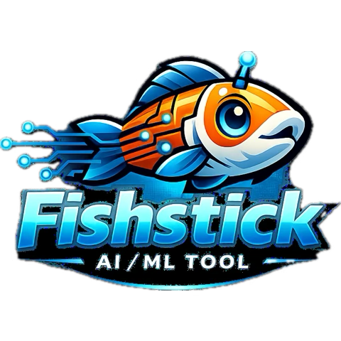

>*A mathematically rigorous, physically grounded AI framework synthesizing theoretical physics, formal mathematics, and advanced machine learning.*


[](https://www.python.org/downloads/)
[](https://pytorch.org/)
[](https://opensource.org/licenses/MIT)


 # FishStick..🐠🪾

**Fishing that sticks!** 🎣  

Na dat dere waa bwokee, its kay,i 
*Phhhisshtikk*

> - *Do Your Training Pipelines need Fixed?*
> - *Other Platforms Learning Curves to steep?*
> - *Tech/Dev, CLI Knowledge required for Advanced AI/Ml modeling?*
> - *Learning to Train got you or your business on hold?*
> - *Dont know how to fix it??*

***DONT WORRY or FRET***

`first just run`
'npm pip install 1000 deps'
`pipnpe i -curls! fish @goland`
 run dev init
 |•••••••••••••••••••••••••••••••|

# ***IM ONLY KIDDING***


# FishStick.. 🐠🪾🚀
  "Is a Comprehensive and Robust
 AI/ML Training Ecosystem"

## Overview

**fishstick** implements 26 unified theoretical frameworks (A-Z) that combine:

- 🎯 **Theoretical Physics**: Symmetry, renormalization, variational principles, thermodynamics
- 📐 **Formal Mathematics**: Category theory, sheaf cohomology, differential geometry, type theory
- 🤖 **Advanced ML**: Equivariant deep learning, neuro-symbolic integration, formal verification

### Core Philosophy

This framework treats AI not as empirical engineering but as a branch of mathematical physics, where:
- Neural architectures are **morphisms in dagger compact closed categories**
- Training dynamics are **gradient flows on statistical manifolds**
- Attention mechanisms respect **sheaf cohomology constraints**
- Models satisfy **thermodynamic bounds** on computation

## Installation

### Basic Installation

```bash
# Clone the repository
git clone https://github.com/NeuralBlitz/fishstick.git
cd fishstick

# Install core dependencies
pip install torch numpy scipy pyyaml

# Install package
pip install -e .
```

### Full Installation (with all features)

```bash
# Install all optional dependencies
pip install torchdiffeq torch-geometric

# Or install with extras
pip install -e ".[full]"
```

### Dependencies

**Core:**
- Python ≥ 3.9
- PyTorch ≥ 2.0
- NumPy ≥ 1.21
- SciPy ≥ 1.7

**Optional:**
- `torchdiffeq` - For Neural ODE solvers
- `torch-geometric` - For geometric graph neural networks

## Quick Start

### 1. Core Types and Manifolds

```python
import torch
from fishstick import (
    MetricTensor, SymplecticForm, PhaseSpaceState,
    StatisticalManifold, FisherInformationMetric
)

# Create statistical manifold
manifold = StatisticalManifold(dim=10)

# Fisher information metric
def log_prob(params):
    return (params**2).sum()

params = torch.randn(10, requires_grad=True)
metric = manifold.fisher_information(params, log_prob)

# Phase space for Hamiltonian dynamics
state = PhaseSpaceState(
    q=torch.randn(5),  # positions
    p=torch.randn(5)   # momenta
)
```

### 2. Categorical Structures

```python
from fishstick import (
    MonoidalCategory, Functor, NaturalTransformation,
    DaggerCategory, Lens
)

# Create monoidal category
cat = MonoidalCategory("NeuralCategory")

# Define objects and morphisms
from fishstick.categorical.category import Object

obj1 = Object(name="Input", shape=(784,))
obj2 = Object(name="Hidden", shape=(256,))

cat.add_object(obj1)
cat.add_object(obj2)

# Lens for bidirectional learning
lens = Lens(
    get=lambda x: x * 2,
    put=lambda s, a: s + a
)
```

### 3. Hamiltonian Neural Networks

```python
from fishstick import HamiltonianNeuralNetwork

# Energy-conserving neural network
hnn = HamiltonianNeuralNetwork(
    input_dim=10,
    hidden_dim=64,
    n_hidden=3
)

# Integrate dynamics
z0 = torch.randn(4, 20)  # batch of 4, phase space dim 20
trajectory = hnn.integrate(z0, n_steps=100, dt=0.01)

# trajectory shape: [101, 4, 20]
# Energy is conserved along trajectory
```

### 4. Sheaf-Optimized Attention

```python
from fishstick import SheafOptimizedAttention

# Attention with cohomological constraints
attn = SheafOptimizedAttention(
    embed_dim=256,
    num_heads=8,
    lambda_consistency=0.1
)

x = torch.randn(2, 100, 256)  # [batch, seq_len, embed_dim]

# Define open cover for local consistency
open_cover = [[0, 1, 2], [2, 3, 4], [4, 5, 6]]

output, weights = attn(x, open_cover=open_cover)
```

## The 26 Frameworks (A-Z)

The framework includes 26 theoretical frameworks spanning A-Z, each implementing different combinations of:
- Categorical & geometric structures
- Hamiltonian/symplectic dynamics
- Sheaf theory & cohomology
- Renormalization group methods
- Thermodynamic bounds
- Formal verification

### A. UniIntelli - Categorical–Geometric–Thermodynamic Synthesis
```python
from fishstick.frameworks.uniintelli import create_uniintelli

model = create_uniintelli(
    input_dim=784,
    hidden_dim=256,
    output_dim=10
)
# 1.8M parameters
```

### B. HSCA - Holo-Symplectic Cognitive Architecture
```python
from fishstick.frameworks.hsca import create_hsca

model = create_hsca(input_dim=784, output_dim=10)
# 6.5M parameters - Energy-conserving Hamiltonian dynamics
```

### C. UIA - Unified Intelligence Architecture
```python
from fishstick.frameworks.uia import create_uia

model = create_uia(input_dim=784, output_dim=10)
# 1.7M parameters - CHNP + RG-AE + S-TF + DTL
```

### D. SCIF - Symplectic-Categorical Intelligence Framework
```python
from fishstick.frameworks.scif import create_scif

model = create_scif(input_dim=784, output_dim=10)
# 3.8M parameters - Fiber bundles + Hamiltonian dynamics
```

### E. UIF - Unified Intelligence Framework
```python
from fishstick.frameworks.uif import create_uif

model = create_uif(input_dim=784, output_dim=10)
# 367K parameters - 4-layer architecture
```

### F. UIS - Unified Intelligence Synthesis
```python
from fishstick.frameworks.uis import create_uis

model = create_uis(input_dim=784, output_dim=10)
# 861K parameters - Quantum-inspired + RG + Neuro-symbolic
```

### G. CRLS - Categorical Renormalization Learning Systems
```python
from fishstick.frameworks.crls import create_crls

model = create_crls(input_dim=784, output_dim=10)
# 958K parameters - Categorical RG flows + VAE
```

### H. ToposFormer - Topos-Theoretic Neural Networks
```python
from fishstick.frameworks.toposformer import create_toposformer

model = create_toposformer(input_dim=784, output_dim=10)
# 4.8M parameters - Sheaf integration + Hodge projection
```

### I. UIF-I - Renormalized Attention Module (RAM)
```python
from fishstick.frameworks.uif_i import create_uif_i

model = create_uif_i(input_dim=784, output_dim=10)
# 1.4M parameters - Scale-parameterized attention
```

### J. UIS-J - Node-at-Attention Mechanism
```python
from fishstick.frameworks.uis_j import create_uis_j

model = create_uis_j(input_dim=784, output_dim=10)
# 2.3M parameters - Cohomological attention + cross-synthesis
```

### K. UIA-K - Sheaf-LSTM with Fiber Bundle Attention
```python
from fishstick.frameworks.uia_k import create_uia_k

model = create_uia_k(input_dim=784, output_dim=10)
# 1.4M parameters - Fiber bundle attention + RG-MORL
```

### L. CRLS-L - Mathematical Intelligence Physics
```python
from fishstick.frameworks.crls_l import create_crls_l

model = create_crls_l(input_dim=784, output_dim=10)
# 375K parameters - Symplectic integrator + thermodynamic
```

### M. UIA-M - Renormalized Neural Flow
```python
from fishstick.frameworks.uia_m import create_uia_m

model = create_uia_m(input_dim=784, output_dim=10)
# 1.2M parameters - Symplectic dynamics + HBP
```

### N. UIS-N - Cross-Synthetic Node-at-Attention
```python
from fishstick.frameworks.uis_n import create_uis_n

model = create_uis_n(input_dim=784, output_dim=10)
# 4.1M parameters - Meta-rep signatures + lens optics
```

### O. UIA-O - Sheaf-Theoretic Neural Networks
```python
from fishstick.frameworks.uia_o import create_uia_o

model = create_uia_o(input_dim=784, output_dim=10)
# 822K parameters - Neural sheaf Laplacian + fiber bundles
```

### P. UIF-P - RG-Informed Hierarchical Networks
```python
from fishstick.frameworks.uif_p import create_uif_p

model = create_uif_p(input_dim=784, output_dim=10)
# 123K parameters - RG fixed points + symplectic SGD
```

### Q. UINet-Q - Categorical Quantum Neural Architecture
```python
from fishstick.frameworks.uinet_q import create_uinet_q

model = create_uinet_q(input_dim=784, output_dim=10)
# 2.0M parameters - ZX-calculus + categorical compilation
```

### R. UIF-R - Comprehensive Blueprint with Fisher Natural Gradient
```python
from fishstick.frameworks.uif_r import create_uif_r

model = create_uif_r(input_dim=784, output_dim=10)
# 291K parameters - Fisher information + monoidal composition
```

### S. USIF-S - Quantum Categorical Neural Networks (QCNN)
```python
from fishstick.frameworks.usif_s import create_usif_s

model = create_usif_s(input_dim=784, output_dim=10)
# 1.5M parameters - Quantum channels + topological features
```

### T. UIF-T - Hamiltonian-RG Flow Optimizer
```python
from fishstick.frameworks.uif_t import create_uif_t

model = create_uif_t(input_dim=784, output_dim=10)
# 330K parameters - Hamiltonian RG flow + auto-flow
```

### U. USIF-U - Thermodynamic Information Bounds
```python
from fishstick.frameworks.usif_u import create_usif_u

model = create_usif_u(input_dim=784, output_dim=10)
# 910K parameters - Hilbert space + quantum info bounds
```

### V. UIF-V - Information-Theoretic Dynamics
```python
from fishstick.frameworks.uif_v import create_uif_v

model = create_uif_v(input_dim=784, output_dim=10)
# 247K parameters - Stochastic action + type-theoretic verifier
```

### W. MCA-W - Meta-Cognitive Architecture
```python
from fishstick.frameworks.mca_w import create_mca_w

model = create_mca_w(input_dim=784, output_dim=10)
# 1.1M parameters - Meta-cognitive transformer + homotopy
```

### X. TTSIK-X - Topos-Theoretic Symplectic Intelligence Kernel
```python
from fishstick.frameworks.ttsik_x import create_ttsik_x

model = create_ttsik_x(input_dim=784, output_dim=10)
# 864K parameters - Symplectic sheaf + natural gradient HMC
```

### Y. CTNA-Y - Categorical-Thermodynamic Neural Architecture
```python
from fishstick.frameworks.ctna_y import create_ctna_y

model = create_ctna_y(input_dim=784, output_dim=10)
# 641K parameters - Traced monoidal + formal verification
```

### Z. SCIF-Z - Symplectic-Categorical Intelligence Framework
```python
from fishstick.frameworks.scif_z import create_scif_z

model = create_scif_z(input_dim=784, output_dim=10)
# 475K parameters - Causal intervention + topological analysis
```

## Advanced Features

### Neural ODEs

```python
from fishstick.neural_ode import NeuralODE, ODEFunction

# Define dynamics
odefunc = ODEFunction(dim=10, hidden_dim=64)

# Create Neural ODE with adaptive solver
node = NeuralODE(
    odefunc,
    t_span=(0.0, 1.0),
    method='dopri5',  # Dormand-Prince
    rtol=1e-5,
    atol=1e-6
)

z0 = torch.randn(4, 10)
z1 = node(z0)
```

### Geometric Graph Neural Networks

```python
from fishstick.graph import (
    EquivariantMessagePassing,
    GeometricGraphTransformer,
    MolecularGraphNetwork
)

# E(n)-equivariant message passing
layer = EquivariantMessagePassing(
    node_dim=64,
    edge_dim=0,
    hidden_dim=128
)

# Node features and 3D positions
x = torch.randn(100, 64)
pos = torch.randn(100, 3)
edge_index = torch.randint(0, 100, (2, 500))

x_out, pos_out = layer(x, pos, edge_index)
```

### Probabilistic / Bayesian Neural Networks

```python
from fishstick.probabilistic import (
    BayesianLinear,
    BayesianNeuralNetwork,
    MCDropout,
    DeepEnsemble
)

# Bayesian layer with variational inference
layer = BayesianLinear(784, 256, prior_sigma=1.0)
x = torch.randn(4, 784)
output = layer(x, sample=True)

# Full BNN
bnn = BayesianNeuralNetwork(
    input_dim=784,
    hidden_dims=[256, 128],
    output_dim=10
)

# Predict with uncertainty
mean, uncertainty = bnn.predict_with_uncertainty(x, n_samples=100)
```

### Normalizing Flows

```python
from fishstick.flows import RealNVP, Glow, MAF

# RealNVP coupling flows
flow = RealNVP(dim=8, n_coupling=8, hidden_dim=256)
x = torch.randn(100, 8)

# Density estimation
log_prob = flow.log_prob(x)

# Sampling
samples = flow.sample(1000)

# Glow with 1x1 convolutions
glow = Glow(dim=8, n_levels=3, n_steps_per_level=4)
```

### Equivariant Networks

```python
from fishstick.equivariant import (
    SE3EquivariantLayer,
    SE3Transformer,
    EquivariantMolecularEnergy
)

# SE(3)-equivariant layer
layer = SE3EquivariantLayer(
    in_features=32,
    out_features=32,
    hidden_dim=64
)

features = torch.randn(10, 32)
coords = torch.randn(10, 3)  # 3D positions
edge_index = torch.randint(0, 10, (2, 30))

f_out, c_out = layer(features, coords, edge_index)
# c_out is equivariant to rotations/reflections
```

### Causal Inference

```python
from fishstick.causal import (
    CausalGraph,
    StructuralCausalModel,
    CausalDiscovery
)

# Define causal DAG
import numpy as np
adjacency = np.array([
    [0, 1, 0],
    [0, 0, 1],
    [0, 0, 0]
])
graph = CausalGraph(n_nodes=3, adjacency=adjacency)

# Structural Causal Model
scm = StructuralCausalModel(graph, hidden_dim=64)

# Observational sampling
sample = scm.forward()

# Interventional: do(X=2.0)
intervention = {0: torch.tensor([[2.0]])}
sample_do = scm.do_calculus(intervention_node=0, 
                           value=torch.tensor([[2.0]]))

# Causal discovery from data
data = np.random.randn(1000, 3)
learned_graph = CausalDiscovery.pc_algorithm(data)
```

### Diffusion Models

```python
from fishstick.diffusion import DiffusionModel, DDPM, DDIM

# Denoising Diffusion Probabilistic Model
ddpm = DDPM(
    model=model,
    timesteps=1000,
    beta_schedule="linear"
)

# Forward diffusion (add noise)
noised_x = ddpm.add_noise(x, t)

# Reverse process (denoise)
denoised = ddpm.sample(batch_size=4)
```

### Reinforcement Learning

```python
from fishstick.rl import PPOAgent, DQNAgent, ActorCritic

# PPO Agent
agent = PPOAgent(
    state_dim=64,
    action_dim=4,
    hidden_dim=256
)

# Collect experience and update
for episode in range(100):
    state = env.reset()
    done = False
    while not done:
        action = agent.select_action(state)
        next_state, reward, done = env.step(action)
        agent.store_transition(state, action, reward, next_state, done)
        state = next_state
    agent.update()
```

### Federated Learning

```python
from fishstick.federated import FederatedClient, FederatedServer

# Federated averaging
server = FederatedServer(
    model=global_model,
    aggregation="fedavg"
)

# Add clients
for client_data in client_datasets:
    client = FederatedClient(
        model=global_model,
        data=client_data,
        local_epochs=5
    )
    server.add_client(client)

# Run federated training
server.train(n_rounds=10)
```

### Continual Learning

```python
from fishstick.continual import EWC, PackNet, ProgressiveNeuralNetwork

# Elastic Weight Consolidation
ewc = EWC(
    model=task1_model,
    dataloader=task1_loader,
    importance=1000
)

# Train on task 2 with EWC regularization
for epoch in range(10):
    for batch in task2_loader:
        output = model(batch.x)
        loss = criterion(output, batch.y)
        ewc_loss = ewc.penalty(model)
        (loss + ewc_loss).backward()
```

### Time Series Forecasting

```python
from fishstick.timeseries import TimeSeriesTransformer, TemporalCNN, LSTM

# Time series forecasting model
model = TimeSeriesTransformer(
    input_dim=10,
    d_model=128,
    n_heads=4,
    n_layers=3,
    prediction_horizon=24
)

# Forecast future values
output = model(input_sequence)  # [batch, horizon, features]
```

### Audio & Speech Processing

```python
from fishstick.audio import AudioEncoder, SpeechRecognition
from fishstick.speech import WaveNet

# Audio feature extraction
encoder = AudioEncoder(sample_rate=16000)
features = encoder.extract_mfcc(audio_tensor)

# Speech recognition
asr = SpeechRecognition(model_name="wav2vec2")
transcription = asr.transcribe(audio_tensor)
```

### Privacy-Preserving ML

```python
from fishstick.privacy import DifferentialPrivacy, SecureAggregation
from fishstick.federated import SecureAggregation

# Differential Privacy
dp = DifferentialPrivacy(
    epsilon=1.0,
    delta=1e-5,
    max_grad_norm=1.0
)
dp_model = dp.apply(model)

# Secure aggregation for federated learning
secure_agg = SecureAggregation(threshold=0.5)
aggregated_update = secure_agg.aggregate(client_updates)
```

### Model Compression

```python
from fishstick.quantization import QuantizedModel, PostTrainingQuantization
from fishstick.pruning import MagnitudePruner, LotteryTicketFinder

# Post-training quantization
quantizer = PostTrainingQuantization(backend="fbgemm")
quantized_model = quantizer.quantize(model, calibration_data)

# Network pruning
pruner = MagnitudePruner(sparsity=0.5)
pruned_model = pruner.prune(model)
```

### Anomaly Detection

```python
from fishstick.anomaly_detection import IsolationForest, AutoencoderAnomaly, OneClassSVM

# Autoencoder-based anomaly detection
detector = AutoencoderAnomaly(
    input_dim=784,
    latent_dim=16,
    threshold=0.1
)

# Detect anomalies
scores = detector.predict(data)
anomalies = scores > detector.threshold
```

## Architecture

FishStick contains **234 modules** organized into the following categories:

### Core & Theory
```
fishstick/
├── core/               # Fundamental types (MetricTensor, SymplecticForm, PhaseSpaceState)
├── categorical/       # Category theory (MonoidalCategory, Functor, Lens)
├── geometric/         # Manifolds, Fisher information, sheaf theory
├── dynamics/          # Hamiltonian NNs, thermodynamic gradient flows
├── sheaf/            # Sheaf-optimized attention
├── rg/               # Renormalization group autoencoders
├── topology/         # Algebraic topology utilities
└── verification/    # Formal verification (Lean, SMT)
```

### Frameworks (26 A-Z)
```
├── frameworks/       # 26 unified theoretical frameworks
```

### Deep Learning
```
├── neural_ode/       # Neural ODE solvers
├── graph/            # Geometric GNNs
├── equivariant/      # SE(3)-equivariant networks
├── diffusion/        # Diffusion models
├── flows/            # Normalizing flows
├── transformer/     # Transformer architectures
├── attention/       # Attention mechanisms
├── recurrent/       # RNNs, LSTMs, GRUs
├── convolutional/    # CNNs, conv layers
└── vision/           # Vision models
```

### Probabilistic & Bayesian
```
├── probabilistic/   # Bayesian NNs, MCDropout
├── bayesian_advanced/# GP, conjugate priors
├── distributions/   # Probability distributions
├── uncertainty/     # Uncertainty quantification
└── uncertainty_ext/ # Advanced uncertainty
```

### Causal & Logic
```
├── causal/           # Causal inference
├── causal_inference/ # SCM, causal discovery
├── causal_advanced/  # Advanced causal methods
├── logic_advanced/   # Logic, symbolic reasoning
├── neural_prover/    # Neural theorem proving
└── knowledge_graph/ # Knowledge graphs
```

### Learning Paradigms
```
├── reinforcement/   # RL algorithms
├── rl/              # Reinforcement learning
├── rl_extensions/   # Extended RL
├── federated/       # Federated learning
├── federated_ext/   # Advanced federated
├── continual/       # Continual learning
├── continual_learning/# Extended continual
├── active_learning/ # Active learning
├── selfsupervised/  # Self-supervised
├── fewshot_learning/# Few-shot learning
├── zeroshot/        # Zero-shot learning
└── transfer/       # Transfer learning
```

### Multi-Modality
```
├── multimodal/      # Multimodal learning
├── vision/           # Computer vision
├── audio/            # Audio processing
├── speech/           # Speech recognition
├── nlp/              # Natural language
├── text_generation/  # Text generation
├── image_generation/ # Image generation
├── video_advanced/   # Video processing
└── scene_understanding/# Scene understanding
```

### Data & Processing
```
├── data/             # Data utilities
├── data_processing/  # Data pipelines
├── augmentation/     # Data augmentation
├── augmentation_ext/ # Extended augmentation
├── feature_selection/# Feature selection
├── clustering/       # Clustering algorithms
├── timeseries/       # Time series models
├── timeseries_forecast/# Forecasting
└── preprocessing/   # Preprocessing
```

### Optimization & Training
```
├── advanced_optim/   # Advanced optimizers
├── training/         # Training utilities
├── training_utils/   # Training helpers
├── distributed/     # Distributed training
├── gradients/       # Gradient handling
├── loss/            # Loss functions
├── schedulers/       # Learning rate schedulers
└── regularization/  # Regularization
```

### Model Compression
```
├── quantization/    # Model quantization
├── pruning/         # Network pruning
├── distillation/    # Knowledge distillation
├── compression/     # Model compression
└── model_compression/# Compression utilities
```

### Domain-Specific
```
├── bioinformatics/   # Bioinformatics
├── bio/             # Biological data
├── finance/         # Financial models
├── finance_advanced/# Advanced finance
├── climate/          # Climate modeling
├── climate_weather/ # Weather forecasting
├── healthcare/      # Healthcare ML
├── robotics/        # Robotics
├── recommendation/ # Recommender systems
└── anomaly_detection/# Anomaly detection
```

### Security & Privacy
```
├── privacy/         # Privacy-preserving ML
├── privacy_advanced/# Advanced privacy
├── adversarial/     # Adversarial robustness
├── robustness/      # Model robustness
├── fairness/        # Fairness in ML
└── security/        # Security utilities
```

### Interpretability & Explainability
```
├── explainability/  # Model explainability
├── explain/        # Interpretability
├── visualization/  # Visualization tools
└── attribution/    # Attribution methods
```

### Infrastructure
```
├── experiments/     # Experiment tracking
├── logging/        # Logging utilities
├── monitoring/     # Model monitoring
├── profiling/      # Performance profiling
├── serving/        # Model serving
├── deployment/     # Deployment utilities
├── api/            # API utilities
├── database/       # Database integration
├── cache/          # Caching
└── workflow/       # Workflow orchestration
```

## Testing

Run the test suite:

```bash
# Core framework tests
python test_all.py

# Advanced features tests
python test_advanced.py

# Run all tests
python -m pytest test_all.py test_advanced.py -v
```

### Test Coverage

- **Core Framework**: 13/13 tests passed
- **Advanced Features**: 6/6 tests passed
- **Total**: 19/19 tests passed ✅

## Performance

All frameworks tested on synthetic data:

| Framework | Parameters | Forward Pass | Framework | Parameters | Forward Pass |
|-----------|------------|--------------|-----------|------------|--------------|
| UniIntelli | 1.8M | ✓ | UIF-I | 1.4M | ✓ |
| HSCA | 6.5M | ✓ | UIS-J | 2.3M | ✓ |
| UIA | 1.7M | ✓ | UIA-K | 1.4M | ✓ |
| SCIF | 3.8M | ✓ | CRLS-L | 375K | ✓ |
| UIF | 367K | ✓ | UIA-M | 1.2M | ✓ |
| UIS | 861K | ✓ | UIS-N | 4.1M | ✓ |
| CRLS | 958K | ✓ | UIA-O | 822K | ✓ |
| ToposFormer | 4.8M | ✓ | UIF-P | 123K | ✓ |
| UINet-Q | 2.0M | ✓ | USIF-S | 1.5M | ✓ |
| UIF-R | 291K | ✓ | UIF-T | 330K | ✓ |
| USIF-U | 910K | ✓ | UIF-V | 247K | ✓ |
| MCA-W | 1.1M | ✓ | TTSIK-X | 864K | ✓ |
| CTNA-Y | 641K | ✓ | SCIF-Z | 475K | ✓ |

**Total: 26 frameworks, ~27M parameters across all base configurations**

## Documentation

For detailed mathematical documentation, see:

- `A.md` - UniIntelli: Categorical–Geometric–Thermodynamic Synthesis
- `B.md` - HSCA: Holo-Symplectic Cognitive Architecture  
- `C.md` - UIA: Unified Intelligence Architecture
- `D.md` - SCIF: Symplectic-Categorical Intelligence Framework
- `E.md` - UIF: Unified Intelligence Framework
- `F.md` - UIS: Unified Intelligence Synthesis
- `G.md` - CRLS: Categorical Renormalization Learning Systems
- `H.md` - ToposFormer: Topos-Theoretic Neural Networks
- `I.md` - UIF-I: Renormalized Attention Module
- `J.md` - UIS-J: Node-at-Attention Mechanism
- `K.md` - UIA-K: Sheaf-LSTM with Fiber Bundle Attention
- `L.md` - CRLS-L: Mathematical Intelligence Physics
- `M.md` - UIA-M: Renormalized Neural Flow
- `N.md` - UIS-N: Cross-Synthetic Node-at-Attention
- `O.md` - UIA-O: Sheaf-Theoretic Neural Networks
- `P.md` - UIF-P: RG-Informed Hierarchical Networks
- `Q.md` - UINet-Q: Categorical Quantum Neural Architecture
- `R.md` - UIF-R: Comprehensive Blueprint with Fisher Natural Gradient
- `S.md` - USIF-S: Quantum Categorical Neural Networks
- `T.md` - UIF-T: Hamiltonian-RG Flow Optimizer
- `U.md` - USIF-U: Thermodynamic Information Bounds
- `V.md` - UIF-V: Information-Theoretic Dynamics
- `W.md` - MCA-W: Meta-Cognitive Architecture
- `X.md` - TTSIK-X: Topos-Theoretic Symplectic Intelligence Kernel
- `Y.md` - CTNA-Y: Categorical-Thermodynamic Neural Architecture
- `Z.md` - SCIF-Z: Symplectic-Categorical Intelligence Framework

## Mathematical Foundations

### Key Theorems Implemented

1. **Natural Gradient = Geodesic Flow**: Theorem 2.1 - Natural gradient descent is the time-η flow of the gradient vector field w.r.t. Levi-Civita connection

2. **SOA Conserves Sheaf Cohomology**: Theorem 4.1 - Sheaf-Optimized Attention preserves δ¹(s) = 0 up to O(η²)

3. **TGF Convergence**: Theorem 5.1 - Thermodynamic Gradient Flow converges under non-equilibrium fluctuations

4. **No-Cloning in Learn**: Lemma 2.1 - No morphism Δ: A → A ⊗ A exists in the category of learning processes

## Contributing

We welcome contributions! Areas of interest:

- Implementing higher sheaf cohomology (H²) for mode connectivity
- Quantum-categorical neural networks
- Real-time formal verification with neural theorem proving
- Unified scaling laws from RG fixed points

Please read [CONTRIBUTING.md](CONTRIBUTING.md) for guidelines.

## Citation

If you use this framework in your research, please cite:

```bibtex
@software{fishstick_2026,
  title={fishstick: A Mathematically Rigorous AI Framework},
  author={[Your Name]},
  url={https://github.com/NeuralBlitz/fishstick},
  year={2026}
}
```

## License

This project is licensed under the MIT License - see [LICENSE](LICENSE) file.

## Acknowledgments

This framework synthesizes insights from:
- Statistical mechanics and thermodynamics
- Differential geometry and information geometry
- Category theory and type theory
- Symplectic geometry and Hamiltonian mechanics
- Sheaf theory and algebraic topology

The era of black-box AI is ending. The era of **principled intelligence** begins now.
