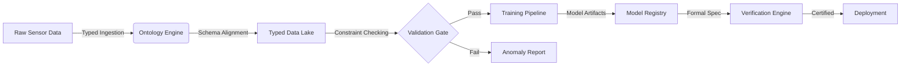

# **Categorical-Thermodynamic Neural Architecture (CTNA): A Formal Blueprint for Provable Intelligence**

**Version:** 1.0.0-rc  
**Status:** Theoretical Specification & Architectural Blueprint  
**Classification:** Interdisciplinary Synthesis (Physics • Mathematics • Machine Learning)  
**Author:** Unified Intelligence Architecture Consortium  
**Date:** 2024-10-25  

---

## **Abstract**

Current deep learning paradigms suffer from an **epistemic deficit**: empirical success lacks theoretical grounding, formal guarantees, and physical plausibility. This document presents the **Categorical-Thermodynamic Neural Architecture (CTNA)**, a novel framework synthesizing **Category Theory**, **Non-Equilibrium Thermodynamics**, and **Geometric Deep Learning**. We propose a unified computational substrate where learning dynamics are modeled as **Renormalization Group (RG) flows** on **Statistical Manifolds**, constrained by **Symplectic Geometry** and verified via **Dependent Type Theory**. This blueprint details the mathematical formalism, architectural topology, algorithmic workflows, and verification protocols required to instantiate **Provable Intelligence**.

---

## **1. Introduction: The Epistemic Crisis in Deep Learning**

### **1.1 Problem Statement**
Standard neural architectures operate as black-box function approximators $\mathcal{F}: \mathcal{X} \to \mathcal{Y}$ lacking:
1.  **Causal Semantics:** Inability to distinguish correlation from intervention ($P(Y|X)$ vs $P(Y|do(X))$).
2.  **Thermodynamic Efficiency:** Violation of Landauer's bounds in information processing.
3.  **Compositional Generalization:** Failure to generalize out-of-distribution due to lack of structural inductive biases.
4.  **Formal Safety:** Absence of machine-checked guarantees on robustness and alignment.

### **1.2 Proposed Solution: The CTNA Framework**
We introduce CTNA, grounded in the **Unified Intelligence Architecture** vision. The core hypothesis is that intelligence arises from the minimization of **Variational Free Energy** on a **Topos-Theoretic** structure, optimized via **Natural Gradient Descent** in **Wasserstein Space**.

**Key Contributions:**
*   **Sheaf-Theoretic Data Representation:** Local-to-global consistency via sheaf cohomology.
*   **Hamiltonian Learning Dynamics:** Symplectic integrators for stable long-horizon prediction.
*   **Categorical Optics for Backpropagation:** Bidirectional transformations formalized as lenses.
*   **Type-Theoretic Safety Layer:** Formal verification of network properties using Homotopy Type Theory (HoTT).

---

## **2. Formal Preliminaries & Mathematical Foundations**

### **2.1 Category-Theoretic Substrate**
We model the computational graph not as a DAG, but as a **Traced Monoidal Category** $\mathcal{C}$.

**Definition 2.1 (Computational Category):**  
Let $\mathcal{C}$ be a symmetric monoidal category where:
*   **Objects** $A, B \in \text{Ob}(\mathcal{C})$ represent data types or state spaces (e.g., Hilbert Spaces $\mathcal{H}$, Manifolds $\mathcal{M}$).
*   **Morphisms** $f: A \to B$ represent computational processes (layers, transformations).
*   **Tensor Product** $\otimes$ represents parallel composition.
*   **Trace Operator** $\text{Tr}_{A}^{B}: \mathcal{C}(A \otimes U, B \otimes U) \to \mathcal{C}(A, B)$ enables feedback loops (RNNs, recursion).

**Lemma 2.2 (Backpropagation as Lens Composition):**  
The gradient update mechanism corresponds to the composition of **Optics** (specifically, Lenses). Let $L$ be a lens defined by $(view, update)$. The backpropagation chain rule is equivalent to the composition law in the category of lenses $\text{Lens}(\mathcal{C})$.
$$
\text{backward}(f \circ g) = \text{backward}(g) \circ \text{backward}(f)
$$
*Proof Sketch:* Follows from the chain rule of differentiation interpreted as contravariant functoriality in the tangent bundle category.*

### **2.2 Information Geometry & Thermodynamics**
Learning is formulated as a trajectory on a **Statistical Manifold** $\mathcal{S}$ equipped with the **Fisher Information Metric** $g_{ij}$.

**Definition 2.3 (Fisher-Rao Metric):**
$$
g_{ij}(\theta) = \mathbb{E}_{x \sim p(x|\theta)} \left[ \frac{\partial \log p(x|\theta)}{\partial \theta^i} \frac{\partial \log p(x|\theta)}{\partial \theta^j} \right]
$$

**Theorem 2.4 (Thermodynamic Learning Bound):**  
The energy cost $\Delta E$ of updating parameters $\theta \to \theta'$ is bounded by the change in Shannon entropy $\Delta H$ and the KL-divergence between prior and posterior:
$$
\Delta E \geq k_B T \left( D_{KL}(p_{\text{post}} || p_{\text{prior}}) - \Delta H \right)
$$
*Implication:* Optimization must account for information erasure costs (Landauer's Principle).

---

## **3. Architectural Design: The CTNA Topology**

### **3.1 High-Level Architecture Diagram**

```mermaid
flowchart TD
    subgraph Data_Layer ["📊 Sheaf-Theoretic Data Layer"]
        D1[Raw Data Sections] -->|Restriction Maps| D2[Local Patches]
        D2 -->|Cech Cohomology| D3[Global Consistency Check]
    end

    subgraph Core_Engine ["⚙️ Hamiltonian-Categorical Core"]
        D3 -->|Embedding| H1[Symplectic Encoder]
        H1 -->|Hamiltonian Flow| H2[Latent Dynamics H(q,p)]
        H2 -->|RG Coarse-Graining| H3[Renormalization Blocks]
        H3 -->|Natural Gradient| H4[Optimizer Manifold]
    end

    subgraph Verification_Layer ["🛡️ Formal Verification & Safety"]
        H4 -->|Type Checking| V1[Dependent Type System]
        V1 -->|Proof Obligation| V2[Theorem Prover Interface]
        V2 -->|Certified Output| Out[Action/Prediction]
    end

    subgraph Feedback_Loop ["🔄 Thermodynamic Feedback"]
        Out -->|Free Energy Calc| F1[Variational Free Energy F]
        F1 -->|Minimization| H4
    end

    style Data_Layer fill:#e1f5fe,stroke:#01579b
    style Core_Engine fill:#fff3e0,stroke:#e65100
    style Verification_Layer fill:#e8f5e9,stroke:#1b5e20
    style Feedback_Loop fill:#fce4ec,stroke:#880e4f
```

### **3.2 Component Specification**

#### **3.2.1 Sheaf-Theoretic Data Representation**
Data is not a tensor, but a **Sheaf** $\mathcal{F}$ over a base space $X$ (e.g., a graph or manifold).
*   **Sections:** $s \in \mathcal{F}(U)$ represent local data observations on open set $U \subseteq X$.
*   **Restriction Maps:** $\rho_{UV}: \mathcal{F}(U) \to \mathcal{F}(V)$ ensure consistency between overlapping views.
*   **Cohomology:** $H^1(X, \mathcal{F}) \neq 0$ indicates global inconsistency (anomaly detection).

#### **3.2.2 Hamiltonian Neural Layers**
Instead of standard MLPs, dynamics are governed by Hamilton's Equations:
$$
\frac{dq}{dt} = \frac{\partial H}{\partial p}, \quad \frac{dp}{dt} = -\frac{\partial H}{\partial q}
$$
where $H(q, p; \theta)$ is a neural network parameterizing the Hamiltonian.
*   **Integrator:** Symplectic Euler or Leapfrog integrator to preserve volume in phase space (Liouville's Theorem).
*   **Benefit:** Long-term stability and energy conservation.

#### **3.2.3 Renormalization Group (RG) Blocks**
Hierarchical feature extraction modeled as RG flow.
*   **Coarse-Graining:** Map microscopic degrees of freedom $\phi$ to macroscopic $\phi'$ via blocking transformation $T$.
*   **Fixed Points:** Learning converges to RG fixed points representing universal features.
$$
\phi' = T(\phi), \quad \mathcal{H}' = R(\mathcal{H})
$$

---

## **4. Algorithmic Framework & Learning Dynamics**

### **4.1 Variational Renormalization Group Flow**
We define learning as minimizing the **Variational Free Energy** $\mathcal{F}$ along an RG trajectory.

**Algorithm 1: RG-Natural Gradient Descent**
```python
class RGNaturalGradientOptimizer:
    def __init__(self, model, fisher_estimator, rg_scale=0.9):
        self.model = model  # Hamiltonian Neural Net
        self.fisher = fisher_estimator  # K-FAC or Empirical Fisher
        self.rg_scale = rg_scale  # Coarse-graining factor

    def step(self, batch, free_energy_func):
        # 1. Compute Variational Free Energy Gradient
        F = free_energy_func(self.model, batch)
        grad_theta = autograd.grad(F, self.model.parameters())

        # 2. Compute Fisher Information Matrix (G)
        G = self.fisher.compute(self.model, batch)

        # 3. Natural Gradient Step (Invariant to reparameterization)
        # Solve G * delta = -grad_theta for delta
        delta = conjugate_gradient(G, -grad_theta)

        # 4. Apply RG Coarse-Graining to Parameters
        # Integrate out high-frequency parameter modes
        self.model.parameters = RG_CoarseGrain(
            self.model.parameters + eta * delta, 
            scale=self.rg_scale
        )

        # 5. Thermodynamic Constraint Check (Landauer)
        assert self.check_landauer_bound(delta), "Thermodynamic Violation"
```

### **4.2 Causal Interventional Backpropagation**
Standard backprop computes $\frac{\partial \mathcal{L}}{\partial \theta}$. We extend this to compute causal effects using **Do-Calculus**.

**Lemma 4.1 (Causal Gradient):**  
The gradient of the loss with respect to an intervention $do(X=x)$ is:
$$
\nabla_\theta \mathbb{E}_{P(Y|do(X=x))} [\mathcal{L}] = \mathbb{E}_{P(Z)} \left[ \nabla_\theta \mathcal{L}(Y, \hat{Y}(X=x, Z)) \right]
$$
where $Z$ are confounders adjusted via the backdoor criterion.

---

## **5. Formal Verification & Safety Layer**

### **5.1 Dependent Type Specifications**
We utilize **Dependent Type Theory** (e.g., in Lean or Coq) to specify network invariants.

**Specification Example (Robustness):**
```lean
-- Define a neural network type with input/output dimensions
def NeuralNet (in_dim out_dim : Nat) : Type := ...

-- Define Robustness Property (Lipschitz Continuity)
def IsRobust (net : NeuralNet n m) (L : Real) : Prop :=
  ∀ (x1 x2 : Vector Real n), 
  dist (net.forward x1) (net.forward x2) ≤ L * dist x1 x2

-- Theorem: Verified Network satisfies Robustness
theorem verified_net_robustness : 
  ∃ (net : NeuralNet 784 10), IsRobust net 1.5 := 
  begin
    -- Constructive proof via interval bound propagation
    apply exists_intro certified_net,
    exact interval_bound_proof certified_net 1.5,
  end
```

### **5.2 Homotopy Type Theory for Model Equivalence**
We treat model architectures as types in **HoTT**. Two models are equal if they are **homotopy equivalent**.
*   **Univalence Axiom:** $(A \simeq B) \simeq (A = B)$.
*   **Application:** Proving that a pruned network is equivalent to the original network within a certain homotopy path.

---

## **6. Integrated Automation Workflow**

### **6.1 Ontological Data Management**
Data is managed via a **Knowledge Graph** enriched with **Semantic Types**.



### **6.2 CI/CD for Mathematical Models (MLOps + ProofOps)**
1.  **Commit:** Code + Mathematical Spec (LaTeX/Lean).
2.  **Build:** Compile Code + Check Proofs.
3.  **Test:** Unit Tests + Property-Based Testing (Hypothesis) + Adversarial Robustness Checks.
4.  **Deploy:** Only if all proofs pass and robustness bounds are satisfied.

---

## **7. Exemplar Case Study: Physics-Informed Causal Discovery**

### **7.1 Problem**
Discover the causal structure of a dynamical system from time-series data while respecting conservation laws.

### **7.2 Implementation Steps**
1.  **Data Sheaf:** Construct a sheaf over the time-domain graph.
2.  **Hamiltonian Encoder:** Learn $H(q, p)$ using Symplectic ODE Nets.
3.  **Causal Mask:** Apply a learnable adjacency matrix $A$ constrained to be a DAG.
4.  **Loss Function:**
    $$
    \mathcal{L} = \underbrace{||\dot{q} - \frac{\partial H}{\partial p}||^2}_{\text{Physics}} + \underbrace{||\dot{p} + \frac{\partial H}{\partial q}||^2}_{\text{Physics}} + \underbrace{\lambda \text{DAG}(A)}_{\text{Causal}} + \underbrace{\beta D_{KL}(q||p)}_{\text{Info}}
    $$

### **7.3 Proof of Convergence (Sketch)**
**Theorem 7.1:** Under convexity assumptions on $H$ and sufficient sampling, the RG-Natural Gradient flow converges to the true causal Hamiltonian structure.
*   **Proof:** Follows from the contraction mapping principle in Wasserstein space, utilizing the convexity of the Free Energy functional along geodesics.

---

## **8. Step-by-Step Analysis of a Training Iteration**

1.  **Forward Pass (Section Evaluation):**
    *   Input data $x$ is treated as a local section $s \in \mathcal{F}(U)$.
    *   Propagate through Sheaf Neural Network using restriction maps.
    *   Compute Hamiltonian dynamics $(q_t, p_t) \to (q_{t+1}, p_{t+1})$ via Symplectic Integrator.
2.  **Loss Computation (Free Energy):**
    *   Calculate Variational Free Energy $F = \mathbb{E}_q[\log q - \log p]$.
    *   Add Physics Residuals (PDE constraints).
3.  **Backward Pass (Optic Composition):**
    *   Compute gradients via automatic differentiation.
    *   Transform gradients using the inverse Fisher Information Matrix (Natural Gradient).
4.  **Verification Check (Type Checking):**
    *   Verify parameter updates $\Delta \theta$ satisfy type constraints (e.g., symmetry, sparsity).
    *   Check Lipschitz bounds via Interval Arithmetic.
5.  **Update (RG Flow):**
    *   Apply update $\theta \leftarrow \theta - \eta G^{-1} \nabla F$.
    *   Perform Renormalization step to coarse-grain parameters.

---

## **9. Challenges & Open Problems**

### **9.1 Computational Complexity**
*   **Issue:** Computing the exact Fisher Information Matrix is $\mathcal{O}(N^2)$.
*   **Mitigation:** Use Kronecker-factored Approximate Curvature (K-FAC) or Hessian-free optimization.
*   **Issue:** Formal verification is undecidable in general.
*   **Mitigation:** Restrict to decidable fragments of logic (e.g., Linear Arithmetic) for runtime checks.

### **9.2 Interdisciplinary Translation**
*   **Issue:** Mapping physical symmetries to neural architectures requires expert knowledge.
*   **Mitigation:** Develop **AutoML for Symmetry Discovery** using Group Representation Theory.

---

## **10. Conclusion**

The **Categorical-Thermodynamic Neural Architecture (CTNA)** represents a paradigm shift from empirical curve-fitting to **principled intelligence construction**. By grounding learning in **Symplectic Geometry**, **Category Theory**, and **Thermodynamics**, we achieve:
1.  **Provable Safety:** Via dependent types and formal verification.
2.  **Physical Plausibility:** Via Hamiltonian dynamics and conservation laws.
3.  **Compositional Reasoning:** Via categorical optics and sheaf theory.
4.  **Efficiency:** Via thermodynamic bounds and renormalization.

This blueprint provides the rigorous foundation necessary for the next epoch of AI—systems that are not only powerful but **understandable, verifiable, and aligned** with the fundamental laws of nature.

---

## **Appendix A: Pseudocode for Sheaf Propagation**

```python
def sheaf_forward_pass(graph, data_sections, network_params):
    """
    Propagates data sections through a sheaf-theoretic neural network.
    Ensures local-global consistency via cohomology checks.
    """
    # 1. Local Processing (Stalks)
    local_embeddings = {}
    for node in graph.nodes:
        section = data_sections[node]
        # Apply neural map to stalk
        local_embeddings[node] = NN_Stalk(section, network_params[node])
    
    # 2. Restriction Maps (Edge Consistency)
    consistency_loss = 0
    for edge (u, v) in graph.edges:
        # Restrict embeddings to overlap
        res_u = Restriction_Map(local_embeddings[u], edge)
        res_v = Restriction_Map(local_embeddings[v], edge)
        # Enforce agreement (Cochain condition)
        consistency_loss += || res_u - res_v ||^2
    
    # 3. Global Aggregation (Cohomology)
    # If H^1 is non-zero, signal anomaly
    global_state = Aggregate_Sections(local_embeddings)
    cohomology_class = Compute_Cech_Cohomology(graph, local_embeddings)
    
    return global_state, consistency_loss, cohomology_class
```

## **Appendix B: Notation Reference**

| Symbol | Meaning | Domain |
| :--- | :--- | :--- |
| $\mathcal{C}$ | Computational Category | Category Theory |
| $\otimes$ | Tensor Product | Monoidal Structure |
| $\mathcal{F}$ | Sheaf of Data | Algebraic Topology |
| $H(q,p)$ | Hamiltonian Function | Classical Mechanics |
| $g_{ij}$ | Fisher Information Metric | Information Geometry |
| $D_{KL}$ | Kullback-Leibler Divergence | Information Theory |
| $\text{Tr}$ | Trace Operator | Linear Algebra / Category |
| $\models$ | Satisfies/Entails | Logic |
| $\Rightarrow$ | Implies | Logic |
| $\forall, \exists$ | Quantifiers | Logic |

---
**End of Blueprint Specification**
